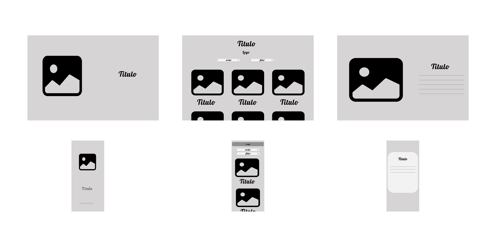

# Data Lovers - Studio Ghibli

### Definición de producto

Se desarrolló una página web dirigida a los fans de Studio Ghibli, cuyo objetivo es consultar información acerca de las películas.

Esta información consta de:
- Título de la película
- Año de lanzamiento
- Director
- Descripción
- Puntuación
- Procentaje de personajes femeninos
- Procentaje de personajes masculino
- Procentaje de personajes sin género especificado

Además el contenido cuenta con:
- Ordenamiento de A - Z
- Ordenamiento de Z - A
- Ordenamiento de mayor a menor puntuación
- Ordenamiento de menor a mayor puntuación
- Ordenamiento de mayor a menor año
- Ordenamiento de menor a mayor año
- Filtrado por Director

## Historias de usuario

[Trello](https://trello.com/invite/b/Nko6slje/ATTI2f87e82cf3d754776db553f2d78cfd5cE981ADA3/data-lovers)

## Prototipo de baja fidelidad

[Figma](https://www.figma.com/file/6UAjZ4GLKTq3gBqbQjaNjy/Studio-Ghibli?node-id=25-2&t=ozAUbUNDg03At5SK-0)

## Prototipo de alta fidelidad

[Figma](https://www.figma.com/file/6UAjZ4GLKTq3gBqbQjaNjy/Studio-Ghibli?node-id=0-1&t=ozAUbUNDg03At5SK-0)

## Link 
URL: [Studio Ghibli](https://moniglz.github.io/DEV005-data-lovers/)
## Test de usabilidad

**La imagen de fondo para la pantalla principal tenía un color muy intenso para la vista**

### Solución: 
- Cambiamos el fondo por uno más amigable a la vista.

**Poder cerrar el modal dando click en otro espacio de la página**

### Solución: 
- Agregamos el evento click a window, validamos con target si el click se estaba haciendo dentro del modal, si esto era verdadero, se cerraba el modal.

**En la vista móvil se creaba un espacio en blanco cuando el contenido no abarcaba toda la pantalla**

### Solución: 
- Definir dentro de la media querie en la seccion de películas un height automático y un mínimo de height de 100vh.

## Authors

- [@moniglz](https://github.com/moniglz)
- [@ifdotcom](https://github.com/ifdotcom)

## Objetivos de aprendizaje

Reflexiona y luego marca los objetivos que has llegado a entender y aplicar en tu proyecto. Piensa en eso al decidir tu estrategia de trabajo.

### HTML

- [X] **Uso de HTML semántico**

### CSS

- [X] **Uso de selectores de CSS**

- [X] **Modelo de caja (box model): borde, margen, padding**

- [X] **Uso de flexbox en CSS**

### Web APIs

- [X] **Uso de selectores del DOM**

- [X] **Manejo de eventos del DOM (listeners, propagación, delegación)**

- [X] **Manipulación dinámica del DOM**
### JavaScript

- [X] **Diferenciar entre tipos de datos primitivos y no primitivos**

- [X] **Arrays (arreglos)**

- [X] **Objetos (key, value)**

- [X] **Variables (declaración, asignación, ámbito)**

- [X] **Uso de condicionales (if-else, switch, operador ternario, lógica booleana)**

- [X] **Uso de bucles/ciclos (while, for, for..of)**

- [X] **Funciones (params, args, return)**

- [X] **Pruebas unitarias (unit tests)**

- [X] **Módulos de ECMAScript (ES Modules)**

- [X] **Uso de linter (ESLINT)**

- [X] **Uso de identificadores descriptivos (Nomenclatura y Semántica)**

- [X] **Diferenciar entre expresiones (expressions) y sentencias (statements)**

### Control de Versiones (Git y GitHub)

- [X] **Git: Instalación y configuración**

- [X] **Git: Control de versiones con git (init, clone, add, commit, status, push, pull, remote)**

- [X] **Git: Integración de cambios entre ramas (branch, checkout, fetch, merge, reset, rebase, tag)**

- [X] **GitHub: Creación de cuenta y repos, configuración de llaves SSH**

- [X] **GitHub: Despliegue con GitHub Pages**

- [X] **GitHub: Colaboración en Github (branches | forks | pull requests | code review | tags)**

### Centrado en el usuario

- [X] **Diseñar y desarrollar un producto o servicio poniendo a las usuarias en el centro**

### Diseño de producto

- [X] **Crear prototipos de alta fidelidad que incluyan interacciones**

- [X] **Seguir los principios básicos de diseño visual**

### Investigación

- [X] **Planear y ejecutar testeos de usabilidad de prototipos en distintos niveles de fidelidad**

## Criterios de aceptación mínimos del proyecto

Los criterios para considerar que has completado este proyecto son:

- [X] Definición del producto

- [X] Historias de usuario

- [X] Diseño de la Interfaz de Usuario

- [X] Prototipo de baja fidelidad

- [X] Prototipo de alta fidelidad

- [X] Testeos de usabilidad

- [X] Implementación de la Interfaz de Usuario (HTML/CSS/JS)

- [X] Pruebas unitarias

## Checklist

* [X] Usa VanillaJS.
* [X] Pasa linter (`npm run pretest`)
* [X] Pasa tests (`npm test`)
* [X] Pruebas unitarias cubren un mínimo del 70% de statements, functions y
  lines y branches.
* [X] Incluye _Definición del producto_ clara e informativa en `README.md`.
* [X] Incluye historias de usuario en `README.md`.
* [X] Incluye _sketch_ de la solución (prototipo de baja fidelidad) en
  `README.md`.
* [X] Incluye _Diseño de la Interfaz de Usuario_ (prototipo de alta fidelidad)
  en `README.md`.
* [X] Incluye link a Zeplin en `README.md`.
* [X] Incluye el listado de problemas que detectaste a través de tests de
  usabilidad en el `README.md`.
* [X] UI: Muestra lista y/o tabla con datos y/o indicadores.
* [X] UI: Permite ordenar data por uno o más campos (asc y desc).
* [X] UI: Permite filtrar data en base a una condición.
* [X] UI: Es _responsive_.
